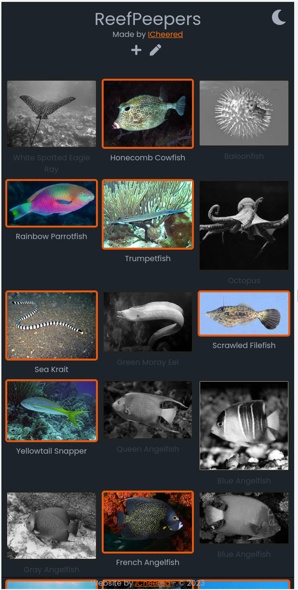

# 🐡🐠 ReefPeepers 🐟🦈

Basically a todo-list but then for keeping tack of fish species.

Also an excuse to learn about using locally hosted file server [FileBrowser](https://filebrowser.org) for storing images.

## Development

Run `yarn install` and `yarn dev` to start the development server.
You need to set your FileBrowser credentials in a `.env` file.

## Deployment

Run `yarn build` and `yarn preview` to start the production server.
